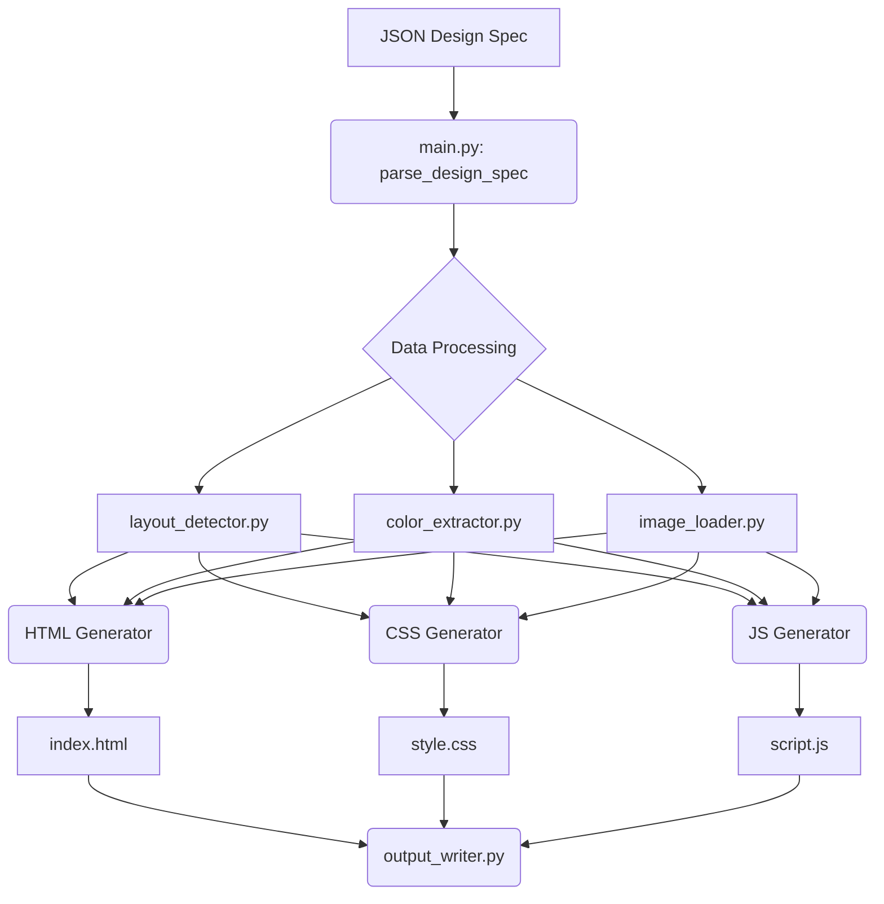

<p align="center">
  
</p>

<h1 align="center">Design2Web</h1>

<p align="center">
  <strong>Convert structured JSON design specifications into runnable web applications.</strong>
</p>

<p align="center">
  <a href="https://github.com/Lumi-node/design2web"></a>
  <a href="https://github.com/Lumi-node/design2web"></a>
  <a href="https://github.com/Lumi-node/design2web"></a>
</p>

---

Design2Web is a tool designed to bridge the gap between design specifications and front-end code. It takes a structured JSON file—detailing layout, components (like buttons, cards, and navigation bars), color palettes, and typography—and automatically generates a complete, runnable web application consisting of `index.html`, `style.css`, and `script.js`.

This project aims to automate the tedious process of translating design intent into boilerplate code, allowing developers to rapidly prototype or deploy applications based on pre-defined structural data.

---

## Quick Start

First, ensure you have Python 3.10 or newer installed.

```bash
pip install design2web
```

To use the core functionality, you would typically feed it a design specification file:

```python
from design2web.main import parse_design_spec, generate_html, generate_css, generate_js

# Assuming 'design_spec.json' exists and is valid
spec = parse_design_spec('design_spec.json')

# Generate the necessary files
html_content = generate_html(spec)
css_content = generate_css(spec)
js_content = generate_js(spec)

# In a real CLI, these would be written to disk by output_writer.py
print("HTML Generated.")
print("CSS Generated.")
print("JS Generated.")
```

## What Can You Do?

### Parse Design Specifications
The `parse_design_spec` function reads a complex JSON structure. It interprets sections, component definitions, color codes, and spacing rules to build an internal, usable representation of the intended design.

```python
from design2web.main import parse_design_spec
# Reads the JSON file and returns a structured object
design_data = parse_design_spec('my_app_design.json')
```

### Generate Semantic HTML
`generate_html` takes the parsed specification and outputs a fully structured `index.html`. It maps design components (e.g., a 'card' component) to appropriate semantic HTML tags.

```python
from design2web.main import generate_html
html_output = generate_html(design_data)
# html_output now contains the complete HTML string
```

### Generate Responsive CSS
`generate_css` translates the styling rules from the JSON into production-ready CSS. It heavily utilizes Flexbox for layout and includes basic responsive breakpoints based on the spec.

```python
from design2web.main import generate_css
css_output = generate_css(design_data)
# css_output contains the complete style.css content
```

### Generate Basic JavaScript Interactivity
`generate_js` creates a `script.js` file containing basic functionality hooks defined in the design spec, such as event listeners for buttons or form validation placeholders.

```python
from design2web.main import generate_js
js_output = generate_js(design_data)
# js_output contains the script.js content
```

## Architecture

The system follows a clear pipeline architecture. The process begins with the **`main.py`** entry point, which orchestrates the workflow.

1.  **Input Layer:** **`parse_design_spec`** (in `main.py`) reads the raw JSON file.
2.  **Data Transformation:** The parsed data is passed through various modules:
    *   **`layout_detector.py`**: Interprets spatial relationships and component placement.
    *   **`color_extractor.py`**: Normalizes and extracts the defined color palette.
    *   **`image_loader.py`**: Handles paths and metadata for assets referenced in the spec.
3.  **Output Generation:** The processed data is fed into the rendering modules:
    *   **`html_generator.py`**: Creates the structural markup.
    *   **`generate_css`** (in `main.py`): Creates the styling rules.
    *   **`generate_js`** (in `main.py`): Creates the behavioral scripts.
4.  **Finalization:** **`output_writer.py`** handles writing the generated strings into the final file structure (`index.html`, `style.css`, etc.).



## API Reference

### `parse_design_spec(json_file: str) -> dict`
Reads and validates the JSON design specification file.
*Returns:* A dictionary containing the fully parsed design structure.

### `generate_html(spec: dict) -> str`
Generates the complete HTML content string based on the specification.
*Example:*
```python
html = generate_html(design_data)
# html contains <html>...</html>
```

### `generate_css(spec: dict) -> str`
Generates the complete CSS content string, applying layout and styling rules.
*Example:*
```python
css = generate_css(design_data)
# css contains body { ... }
```

## Research Background

This tool is inspired by the growing need for low-code/no-code solutions, specifically targeting the friction point where design artifacts (like Figma exports) must be manually translated into code. While the current implementation relies on a rigid JSON schema, the underlying concepts draw from automated UI generation research, particularly those focusing on declarative UI specifications.

## Testing

The project includes 8 dedicated test files located in the `tests/` directory, ensuring that the parsing and generation logic behaves as expected against various mock design specifications.

## Contributing

We welcome contributions! Please see our contribution guidelines (if available) or feel free to open an issue or submit a Pull Request.

## Citation

This project is an independent implementation and does not directly cite specific academic works, but it builds upon the general principles of declarative UI specification.

## License
The project is licensed under the MIT License - see the [LICENSE](LICENSE) file for details.