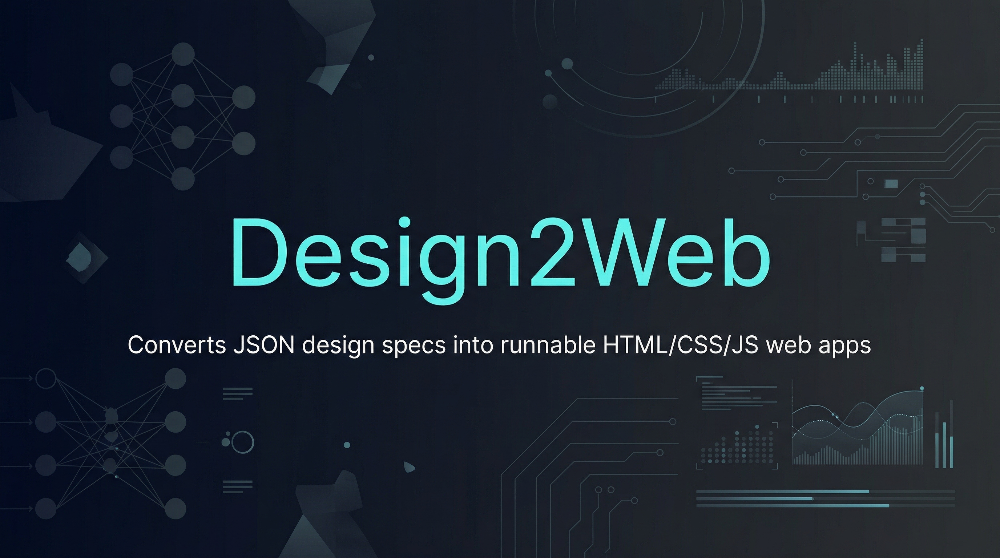

<p align="center">
  
</p>

<h1 align="center">Design2Web</h1>

<p align="center">
  <strong>Converting static design mockups into runnable HTML/CSS web pages.</strong>
</p>

<p align="center">
  <a href="https://github.com/Lumi-node/design2web"></a>
  <a href="https://github.com/Lumi-node/design2web"></a>
  <a href="https://github.com/Lumi-node/design2web"></a>
</p>

---

Design2Web is a proof-of-concept Python tool designed to automate the tedious process of translating static visual design mockups (PNG or JPG) into functional, albeit minimal, HTML and CSS code. It attempts to infer the structural layout of a design by analyzing image characteristics such as color distribution and edge detection.

This project serves as an exploration into the feasibility of raster-to-code conversion using basic computer vision techniques. While it demonstrates the core pipeline—from image loading to HTML generation—it highlights the architectural challenges of inferring semantic structure from unstructured visual data.

---

## Quick Start

First, ensure you have Python 3.10 or newer installed. Then, install the necessary dependencies:

```bash
pip install design2web
```

To convert a design mockup, you would typically use the main entry point function:

```python
from main import convert_design

# Assuming 'mockup.png' is your design file
output_path = convert_design("mockup.png")
print(f"HTML generated successfully at: {output_path}")
```

## What Can You Do?

### Layout Detection
The tool analyzes the input image to segment major UI components (e.g., header, sidebar, content area) using basic image processing techniques.

```python
from image_loader import load_image
from layout_detector import detect_layout_regions

# Load image as numpy array
image = load_image("design.jpg")

# Detect layout regions
regions = detect_layout_regions(image)
# Returns: {'header': {...}, 'sidebar': {...}, 'content': {...}, 'footer': {...}}
```

### Color Extraction
It samples dominant color palettes from the identified regions to apply them as CSS variables in the generated output.

```python
from image_loader import load_image
from layout_detector import detect_layout_regions
from color_extractor import extract_colors

image = load_image("design.jpg")
regions = detect_layout_regions(image)
palette = extract_colors(image, regions)
# Returns: {'header': [(r,g,b), (r,g,b), (r,g,b)], 'sidebar': [...], ...}
```

### HTML Generation
Based on the detected regions and extracted colors, the system constructs a semantic HTML structure, wrapping components in appropriate `div` elements.

```python
from html_generator import generate_html_structure

# Assuming 'regions' from layout detection
html_content = generate_html_structure(regions)
# html_content is the raw HTML string
```

## Architecture

The system follows a sequential pipeline architecture:

1.  **`image_loader.py`**: Handles reading and preprocessing the input raster image.
2.  **`layout_detector.py`**: Takes the image and applies algorithms (e.g., brightness/edge analysis) to segment the image into logical UI regions.
3.  **`color_extractor.py`**: Samples colors from these detected regions to build a design palette.
4.  **`html_generator.py`**: Consumes the region data and color palette to construct the semantic HTML markup.
5.  **`output_writer.py`**: Writes the final HTML and associated CSS into the specified output file path.

```mermaid
graph LR
    A[Input Image (PNG/JPG)] --> B(image_loader.py);
    B --> C{layout_detector.py};
    C --> D[Detected Regions];
    B --> E(color_extractor.py);
    D & E --> F(html_generator.py);
    F --> G(output_writer.py);
    G --> H[Output HTML/CSS];
```

## API Reference

### `main.convert_design(image_path: str) -> str`
The primary entry point. Reads the image, runs the full pipeline, and returns the path to the generated HTML file.

**Example:**
```python
from main import convert_design

path = convert_design("my_design.png")
# path will be the string path to the output file
```

### `layout_detector.detect_layout_regions(image: np.ndarray) -> dict`
Identifies bounding boxes for major UI components via brightness analysis.

**Signature:** `detect_layout_regions(image: np.ndarray) -> dict`

**Args:**
- `image` (np.ndarray): Image array of shape (H, W, 3), dtype uint8, RGB 0-255

**Returns:** Dict with keys `'header'`, `'sidebar'`, `'content'`, `'footer'`. Each value is either `None` or a region dict with keys: `'x'`, `'y'`, `'width'`, `'height'`

**Example:**
```python
from image_loader import load_image
from layout_detector import detect_layout_regions

image = load_image("design.jpg")
regions = detect_layout_regions(image)
# Returns: {
#     'header': {'x': 0, 'y': 0, 'width': 800, 'height': 120},
#     'sidebar': {'x': 0, 'y': 120, 'width': 200, 'height': 480},
#     'content': {'x': 200, 'y': 120, 'width': 600, 'height': 480},
#     'footer': {'x': 0, 'y': 600, 'width': 800, 'height': 100}
# }
```

### `color_extractor.extract_colors(image: np.ndarray, regions: dict) -> dict`
Extracts 3 dominant colors from each detected region via k-means clustering.

**Signature:** `extract_colors(image: np.ndarray, regions: dict) -> dict`

**Args:**
- `image` (np.ndarray): Image array of shape (H, W, 3), dtype uint8, RGB 0-255
- `regions` (dict): Output from `detect_layout_regions()` with keys `'header'`, `'sidebar'`, `'content'`, `'footer'`

**Returns:** Dict mapping region names to lists of exactly 3 RGB tuples. Only includes regions that were detected (non-None in input).

**Example:**
```python
from image_loader import load_image
from layout_detector import detect_layout_regions
from color_extractor import extract_colors

image = load_image("design.jpg")
regions = detect_layout_regions(image)
colors = extract_colors(image, regions)
# Returns: {
#     'header': [(255, 0, 0), (0, 255, 0), (0, 0, 255)],
#     'sidebar': [(200, 100, 50), ...],
#     'content': [...],
#     'footer': [...]
# }
```

## Research Background

This project is inspired by the growing field of visual programming and automated UI generation. The core methodology relies on classical image processing techniques (thresholding, contour detection) to approximate semantic structure, drawing conceptual parallels to early computer vision applications in document analysis.

For more advanced, production-ready solutions, research into multimodal large language models (e.g., GPT-4V) or structured design API integrations (e.g., Figma API) is recommended, as they provide superior semantic understanding over raster analysis.

## Testing

The project includes 8 dedicated test files located in the `tests/` directory, utilizing `pytest` fixtures to ensure the integrity of the pipeline components.

## Contributing

Contributions are welcome! If you find bugs, have suggestions for improvement, or wish to enhance the layout detection algorithms, please feel free to open an issue or submit a pull request.

## Citation

This project is a proof-of-concept and does not cite specific academic papers for its basic image processing implementation, relying instead on standard libraries.

## License
The project is licensed under the MIT License - see the [LICENSE](LICENSE) file for details.