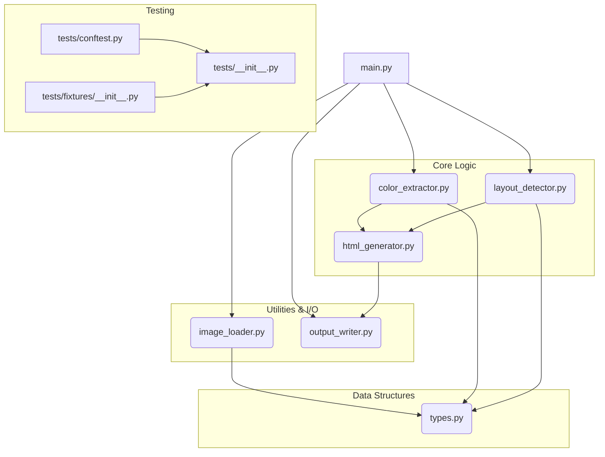

# Architecture: Design2Web

## System Overview

Design2Web is a Python-based utility designed to automate the initial conversion of a static, high-fidelity design mockup (PNG or JPG) into a functional, minimal HTML and CSS web page. The core objective is to bridge the gap between visual design assets and front-end code structure. The system analyzes the input image to infer structural elements (like headers, sidebars, and main content areas) and extract the dominant color palette, which is then used to generate semantic HTML and corresponding inline or embedded CSS.

## Module Relationships

The following diagram illustrates the dependencies and flow between the primary components of the Design2Web system.

## Module Descriptions

| Module | Role | Dependencies |
| :--- | :--- | :--- |
| **`main.py`** | **Entry Point & Orchestrator.** Contains the primary `convert_design(image_path)` function. It manages the overall workflow: loading the image, passing it sequentially through the detection and extraction modules, and finally triggering the HTML generation and writing process. | `image_loader`, `layout_detector`, `color_extractor`, `html_generator`, `output_writer` |
| **`image_loader.py`** | **Input Handler.** Responsible for safely reading and decoding the input image file (PNG/JPG) into a usable image object (e.g., NumPy array or PIL Image object) for subsequent processing. | `types` |
| **`layout_detector.py`** | **Structural Analysis.** Implements algorithms (e.g., basic edge detection, region segmentation based on contrast/color variance) to identify and delineate major UI components within the image (Header, Sidebar, Content, Footer). | `types` |
| **`color_extractor.py`** | **Palette Sampling.** Takes image regions or the whole image and applies clustering or sampling techniques to determine the set of dominant, representative colors for the design. | `types` |
| **`html_generator.py`** | **Code Synthesis.** Takes the structural data (from `layout_detector`) and the color palette (from `color_extractor`) to construct the raw HTML string, including necessary semantic tags and inline/embedded CSS rules. | `types` |
| **`output_writer.py`** | **Persistence Layer.** Handles the final step of writing the generated HTML content string into a specified file path, ensuring the output is correctly formatted and saved. | None |
| **`types.py`** | **Data Contracts.** Defines all core data structures (e.g., `LayoutMap`, `ColorPalette`, `ImageObject`) used across the system to ensure type safety and clear data exchange between modules. | None |
| **`tests/`** | **Testing Suite.** Contains unit and integration tests to validate the functionality of each module independently and collectively. | N/A |

## Data Flow Explanation

The conversion process follows a strict, sequential pipeline orchestrated by `main.py`:

1. **Initialization (`main.py` $\rightarrow$ `image_loader.py`):** The process begins when `main.py` calls `image_loader.load_image(path)`. This module reads the raw image file and returns a standardized `ImageObject` (defined in `types.py`).
2. **Analysis Phase (Parallel/Sequential):**
    * **Layout Detection:** The `ImageObject` is passed to `layout_detector.detect_layout_regions()`. This module analyzes the image structure and returns a `LayoutMap` detailing the coordinates and type of each UI region.
    * **Color Extraction:** Simultaneously or subsequently, the `ImageObject` is passed to `color_extractor.extract_colors()`. This module samples the image and returns a `ColorPalette` object.
3. **Synthesis Phase (`main.py` $\rightarrow$ `html_generator.py`):** The orchestrator gathers the results—the `LayoutMap` and the `ColorPalette`—and passes both to `html_generator.generate_html()`. This module uses this metadata to construct the final, structured HTML string, embedding CSS rules derived from the palette and applying structural classes based on the layout map.
4. **Finalization (`main.py` $\rightarrow$ `output_writer.py`):** The resulting HTML string is passed to `output_writer.write_file(html_content, output_path)`. This module handles the file I/O, completing the conversion and returning the path to the newly created HTML file.