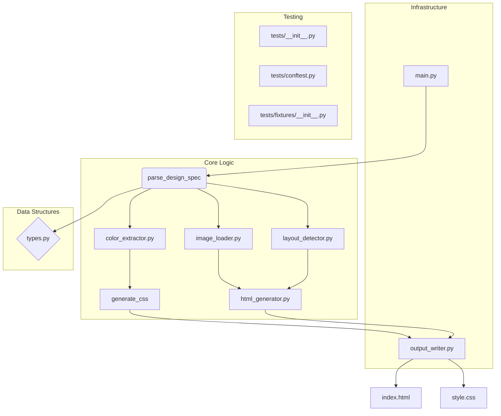

# Architecture: Design2Web

Design2Web is a command-line interface (CLI) tool designed to automate the conversion of structured design specifications (provided in JSON format) into fully functional, static web applications (HTML, CSS, and basic JavaScript). Its primary goal is to bridge the gap between design intent and front-end code generation, allowing designers and developers to rapidly prototype and generate boilerplate web structures.

## System Overview

The system operates as a pipeline, taking a single JSON input file and orchestrating several specialized modules to produce a complete set of static assets. The core logic flows from parsing the abstract design specification, through layout and styling analysis, culminating in the generation of structured HTML and corresponding CSS. Testing is handled via a dedicated `tests/` directory, ensuring the integrity of the conversion process.

## Module Diagram

The following Mermaid diagram illustrates the dependencies and flow between the primary components of Design2Web.

## Module Descriptions

| Module | Role | Key Responsibilities |
| :--- | :--- | :--- |
| **`main.py`** | **Entry Point & Orchestrator** | Initializes the CLI, reads command-line arguments, and manages the high-level execution flow by calling the parsing, detection, and generation modules in sequence. |
| **`types.py`** | **Data Contract Definition** | Defines the core data structures (Pydantic models or dataclasses) used throughout the application to ensure type safety when handling the design specification and intermediate data. |
| **`parse_design_spec(json_file)`** | **Input Handler** | Reads the raw JSON file, validates its structure against the defined types, and transforms the raw data into a standardized, usable internal specification object. |
| **`color_extractor.py`** | **Styling Analysis** | Scans the parsed specification to extract all defined color palettes, hex codes, and semantic color variables, preparing them for CSS generation. |
| **`layout_detector.py`** | **Structural Analysis** | Interprets the layout definitions (e.g., grid, flex properties) from the spec to determine the necessary CSS classes and structural hierarchy required for the HTML. |
| **`image_loader.py`** | **Asset Management** | Handles paths and references to external assets (images, fonts) specified in the design, ensuring they are correctly referenced in the final HTML. |
| **`html_generator.py`** | **Structure Generation** | Takes the processed specification and layout data to construct the semantic HTML markup (`index.html`), including placeholders for components (buttons, cards, etc.). |
| **`generate_css(spec)`** | **Style Generation** | Uses the extracted colors and layout rules to generate the complete, production-ready CSS file (`style.css`), heavily leveraging Flexbox and CSS variables. |
| **`output_writer.py`** | **Persistence Layer** | Responsible for taking the generated HTML and CSS strings and writing them to the specified output directory, creating the final runnable web package. |
| **`tests/`** | **Testing Suite** | Contains unit and integration tests. `conftest.py` manages fixtures, and the module ensures that the conversion logic is robust against various valid and invalid inputs. |

## Data Flow Explanation

The process follows a strict, unidirectional data flow:

1. **Initialization (`main.py`):** The process begins in `main.py`, which accepts the path to the design JSON file.
2. **Parsing & Validation:** `main.py` calls `parse_design_spec()`. This function reads the JSON and validates it against the schema defined in `types.py`, producing a standardized **Design Specification Object**.
3. **Analysis Phase:** The Design Specification Object is then passed to specialized analysis modules:
    * `color_extractor.py` extracts styling data.
    * `layout_detector.py` interprets structural rules.
    * `image_loader.py` resolves asset paths.
4. **Generation Phase:** The enriched specification is fed into the generation modules:
    * `html_generator.py` uses the structural data to build the raw HTML string.
    * `generate_css()` uses the styling data to build the raw CSS string.
5. **Output:** Finally, `output_writer.py` receives the generated HTML and CSS strings and writes them to the filesystem, completing the conversion pipeline.